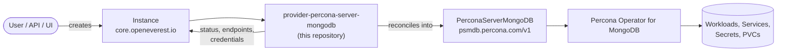

# Percona Server for MongoDB Provider

> [!WARNING]
> **Pre-alpha.** OpenEverest v2 and this provider are under active development. CRD schemas,
> chart values and defaults change frequently, including in breaking ways, and there is no
> supported upgrade path between versions yet. Not for production use.

<!-- Remove the pre-alpha banner and the status badge at v2 GA. -->

[](https://github.com/openeverest/openeverest)
[](https://github.com/openeverest/provider-percona-server-mongodb/actions/workflows/ci.yaml)
[](https://github.com/openeverest/provider-percona-server-mongodb/releases)
[](https://pkg.go.dev/github.com/openeverest/provider-percona-server-mongodb)
[](LICENSE)

Run **Percona Server for MongoDB** on Kubernetes through
[OpenEverest](https://github.com/openeverest/openeverest), backed by the
[Percona Operator for MongoDB](https://github.com/percona/percona-server-mongodb-operator).

## What this is

OpenEverest providers translate a single, technology-agnostic `Instance` custom resource into
the native custom resources of an upstream Kubernetes operator — for databases, but equally
for caches, message queues, object storage, or model-serving runtimes. This repository is the
provider for **Percona Server for MongoDB**: it owns the technology-specific knowledge —
topologies, versions, parameters, backup wiring — so that users, the API server, and the UI
stay technology-agnostic.

> [!IMPORTANT]
> **This provider is not standalone.** It requires an OpenEverest installation (core CRDs and
> controller) in the cluster. Installing this chart on its own does nothing.
> See [Install OpenEverest](https://openeverest.io/documentation/current/quick-install.html).



The provider watches `Instance` resources whose `spec.providerRef.name` is
`percona-server-mongodb`, and reports workload health back onto `Instance.status`. It never
manages pods directly — all lifecycle work is delegated to the operator.

## Compatibility

| provider-percona-server-mongodb | OpenEverest | Percona Operator for MongoDB | Kubernetes |
|---|---|---|---|
| `0.1.x` | `>= 2.0.0` | `1.22.x` | `1.30` – `1.34` |

## Capabilities

What you can do to a running instance through the `Instance` API. Upgrading the
provider itself is covered under [Installation](#installation).

| Capability | Status | Notes |
|---|---|---|
| Provisioning | ✅ | |
| Horizontal scaling | ✅ | `spec.components.<name>.replicas` |
| Vertical scaling (CPU / memory) | ✅ | `spec.components.<name>.resources` |
| Version upgrades | ✅ | of the deployed MongoDB version — change `spec.version`; see [Versions](#versions) |
| Custom configuration | ✅ | `mongod` / `mongos` config via the component's `configuration` parameter |
| Monitoring | ✅ | PMM, via the optional `monitoring` component |
| TLS | ✅ | operator-managed certificates; unsafe TLS is never enabled |

Stateful workloads additionally report:

| Capability | Status | Notes |
|---|---|---|
| Persistent storage | ✅ | `spec.components.engine.storage` |
| Storage expansion | ✅ | when the StorageClass allows volume expansion |
| Backups (on demand) | ✅ | operator-native (`executionMode: ProviderManaged`) via Percona Backup for MongoDB |
| Backups (scheduled) | ✅ | per-storage schedules on `spec.backup.storages[].schedules[]` |
| Point-in-time recovery | ✅ | one storage may enable PITR |
| Restore | ✅ | in place, and into a new Instance via `spec.dataSource` |

## Installation

The provider chart is published to the repository's Helm chart repository:

```bash
helm repo add provider-percona-server-mongodb https://openeverest.github.io/provider-percona-server-mongodb/
helm repo update
helm install provider-percona-server-mongodb provider-percona-server-mongodb/provider-percona-server-mongodb \
  --version 0.1.0 \
  --namespace everest-system
```

- The Percona Operator for MongoDB is bundled as a chart dependency and is installed
  automatically.

Upgrade and uninstall:

```bash
helm repo update
helm upgrade provider-percona-server-mongodb provider-percona-server-mongodb/provider-percona-server-mongodb --version 0.1.0
helm uninstall provider-percona-server-mongodb --namespace everest-system
```

Uninstalling the chart does **not** delete running `Instance` resources or their data.

## Usage

Verify that the provider registered itself:

```bash
kubectl get providers.core.openeverest.io percona-server-mongodb
```

Create an instance:

```yaml
apiVersion: core.openeverest.io/v1alpha1
kind: Instance
metadata:
  name: my-instance
spec:
  providerRef:
    name: percona-server-mongodb
  components:
    engine:
      type: mongod
      replicas: 3
      resources:
        requests:
          cpu: 500m
          memory: 2G
      storage:
        size: 10Gi
```

Component names are defined by this provider — see [definition/provider.yaml](definition/provider.yaml).
`spec.version` and `spec.topology` are optional; the provider defaults apply.
More examples live in [examples/](examples/).

Watch it come up and read the connection details:

```bash
kubectl get instance my-instance -w
kubectl get instance my-instance -o jsonpath='{.status.connection}'
```

Credentials are in the secret named by `.status.connection.credentialsSecretRef`.

## Topologies

<!-- BEGIN GENERATED: topologies -->
| Topology | Default | Description |
|---|---|---|
| `replicaSet` | ✅ | A single replica set (`engine`), 3 members by default |
| `sharded` | | Sharded cluster: `engine` shards, `configServer`, and `mongos` routers (`proxy`); shard count via the topology's `numShards` parameter |
<!-- END GENERATED: topologies -->

The `backupAgent` and `monitoring` components are optional in both topologies.

## Versions

<!-- BEGIN GENERATED: versions -->
| Version bundle | Default | mongod | backup | pmm |
|---|---|---|---|---|
| `8.0.12` | ✅ | `8.0.12-4` | `2.12.0` | `3.7.0` |
| `8.0.8` | | `8.0.8-3` | `2.12.0` | `3.7.0` |
| `8.0.4` | | `8.0.4-1` | `2.12.0` | `3.7.0` |
| `7.0.18` | | `7.0.18-11` | `2.12.0` | `3.7.0` |
| `6.0.21` | | `6.0.21-18` | `2.12.0` | `3.7.0` |
| `6.0.19` | | `6.0.19-16` | `2.12.0` | `3.7.0` |
<!-- END GENERATED: versions -->

Source of truth: [definition/versions.yaml](definition/versions.yaml).

MongoDB only supports upgrading one major version at a time (6.0 → 7.0 → 8.0), and the
operator must already support the target version — upgrade the provider chart first.

## Configuration

- **Chart values:** [charts/provider-percona-server-mongodb/values.yaml](charts/provider-percona-server-mongodb/values.yaml)
- **Instance parameters:** per-component and per-topology `parameters` schemas, defined under
  [definition/](definition/) and published on the `Provider` resource
  (`kubectl get provider percona-server-mongodb -o yaml`). The API server and the UI validate
  user input against these schemas.

The technology-specific knobs worth knowing about:

| Parameter | Applies to | Purpose |
|---|---|---|
| `configuration` | `engine`, `configServer`, `proxy` | Raw `mongod` / `mongos` configuration passed to the operator |
| `monitoringConfigName` | `monitoring` | PMM configuration to attach the instance to |
| `numShards` | `sharded` topology | Number of shards to provision |

## Development

Requires Go (see [go.mod](go.mod)), Docker, Helm, kubectl, and a Kubernetes cluster you can
reach. [dev/README.md](dev/README.md) covers the environment end to end: the recommended
local k3d setup, running against a cluster you already have, and every `dev/.env` setting.

```bash
make dev-up             # local cluster + Tilt dev environment (see dev/README.md)
make generate           # RBAC, provider spec, Helm chart sync
make run                # run the provider locally against the cluster
make test-unit
make test-integration   # chainsaw suites under test/integration/
make dev-down
```

`make help` lists every target. `make verify` fails when generated files are stale — run
`make generate` and commit the result.

The provider contract (`Validate` / `Sync` / `Status` / `Cleanup`), RBAC markers, watches,
code generation, and the backup/restore interfaces are documented once for all providers in
[PROVIDER_DEVELOPMENT.md](https://github.com/openeverest/provider-sdk/blob/main/PROVIDER_DEVELOPMENT.md).

### Layout

| Path | Purpose |
|---|---|
| `cmd/provider/` | Entry point |
| `internal/provider/` | `ProviderInterface` implementation, backup interfaces, RBAC markers |
| `internal/common/` | Component name constants |
| `definition/` | Provider identity, component types, versions, topologies, backup classes |
| `charts/provider-percona-server-mongodb/` | Helm chart (`generated/` is produced by `make generate`) |
| `config/rbac/role.yaml` | Generated `ClusterRole` — do not edit |
| `test/integration/` | Chainsaw suites: `core`, `backup`, `monitoring` |
| `test/e2e/` | Playwright end-to-end tests against the Everest UI |
| `test/vars.sh` | Pinned operator and workload versions used by tests |
| `examples/` | Example `Instance` resources |
| `dev/` | Tilt dev environment, `.env` configuration, k3d cluster config |
| `.github/workflows/` | CI: lint, build, unit and integration tests, release |

### Testing

- **Unit tests** — `make test-unit`.
- **Integration tests** — chainsaw suites under [test/integration/](test/integration/).
  Individual suites are also exposed as make targets (`make test-integration-core`,
  `make test-integration-backup`, `make test-integration-monitoring-pmm`, …).
- **End-to-end tests** — `make test-e2e` drives the Everest UI with Playwright.
- **CI** — [.github/workflows/ci.yaml](.github/workflows/ci.yaml) runs lint, build, unit
  tests, generated-file verification, Helm lint, and each integration suite on every pull
  request.

## Troubleshooting

```bash
kubectl logs -n everest-system deploy/provider-percona-server-mongodb -f
```

| Symptom | Where to look |
|---|---|
| `Instance` stuck in `Creating` | `kubectl describe instance <name>` conditions, then the provider logs |
| No `Provider` resource in the cluster | Is the chart installed? Check the provider deployment logs |
| `Instance` ignored entirely | `spec.providerRef.name` must be `percona-server-mongodb` |
| `PerconaServerMongoDB` created but no pods | Inspect the `PerconaServerMongoDB` status — the failure is upstream in the operator |
| Backups never complete | Check the `Backup` resource status and the `percona-backup-mongodb` agent container logs |

Replica-set members below 3, and `mongos` below 3, are provisioned with the operator's
"unsafe" flags for size only — they are fine for development but not for production.

## Contributing

Issues and pull requests are welcome. See
[PROVIDER_DEVELOPMENT.md](https://github.com/openeverest/provider-sdk/blob/main/PROVIDER_DEVELOPMENT.md)
and the [OpenEverest Code of Conduct](https://github.com/openeverest/openeverest/blob/main/CODE_OF_CONDUCT.md).

## Security

Report vulnerabilities per the
[OpenEverest security policy](https://github.com/openeverest/openeverest/blob/main/SECURITY.md).
Please do not open public issues for security reports.

## License

Apache License 2.0 — see [LICENSE](LICENSE) for details.
